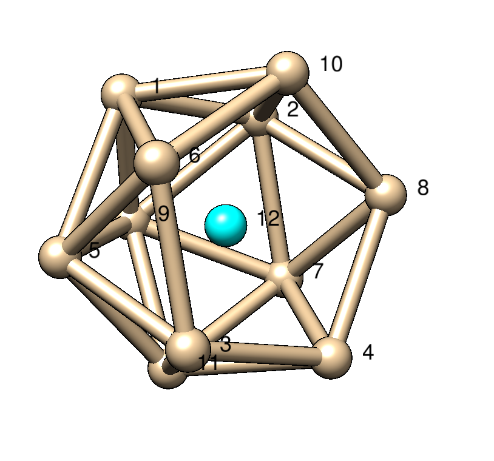
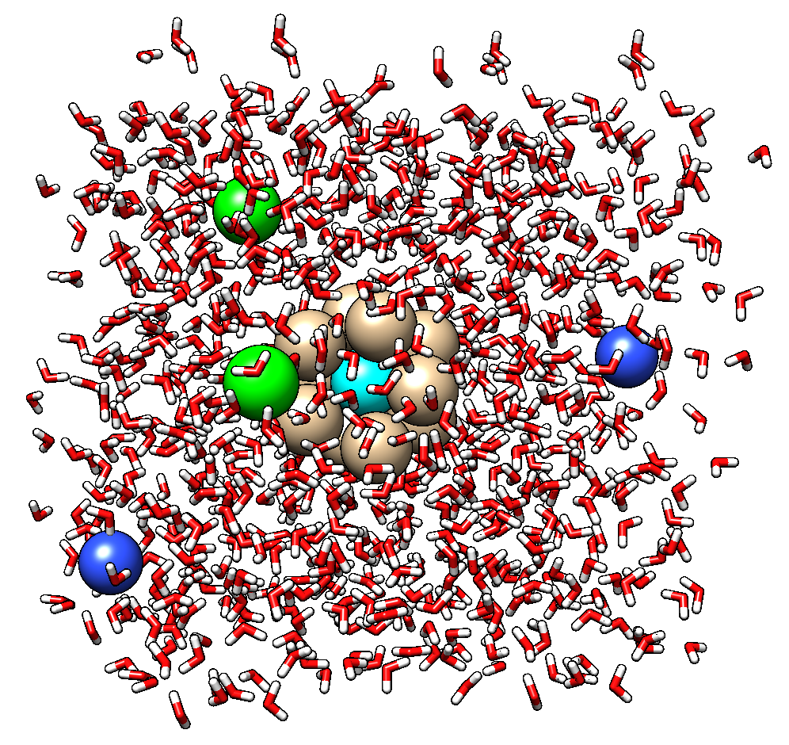

# toy_binding

A GitHub repository for the `toy_binding` project.  

## Description

In this work, we simulate a "toy" binding system in which a ligand can bind and unbind to toy binding pocket. Using this system as a benchmark, our goal is to evaluate the effectiveness of various enhanced sampling schemes to estimate binding affinity and kinetics.

## Simulation system

The *ligand* is a single, uncharged Lennard-Jones (LJ) particle with the same parameters as a CT carbon atom in the AMBER force fields.

The *binding pocket* to an 11-particle icosahedral binding pocket made from the same atom type.




From `pocket.top':
```
;
;       Topology file the pocket
;
; The force-field files to be included
#include "amber99sbnmr1-ildn.ff/forcefield.itp"

;[ defaults ]
; nbfunc        comb-rule       gen-pairs       fudgeLJ fudgeQQ
;1               2               yes             0.5     0.8333

[ atomtypes ]
; name      at.num  mass     charge ptype  sigma      epsilon
LJ           6      12.01    0.0000  A   3.39967e-01  4.57730e-01  ; copied from amber LJ

[ bondtypes ]
; i    j  func       b0          kb
  LJ LJ         1    0.40124   259408.0 ; 7,(1986),230; AA, SUGARS


[ angletypes ]
;  i    j    k  func       th0       cth
LJ  LJ  LJ           1   108.000    150.0 ;  wide icosahedron angle IMPORTANT!

[ dihedraltypes ]
;i   j   k   l     func
 LJ  LJ  LJ  LJ    9       0.0      0.75312     3  ; Junmei et al, 1999
 LJ  LJ  LJ  LJ    9     180.0      1.04600     2  ; Junmei et al, 1999
 LJ  LJ  LJ  LJ    9     180.0      0.83680     1  ; Junmei et al, 1999


[ moleculetype ]
; name  nrexcl
Pocket         3

[ atoms ]
   1  LJ  1  DUM       C1     1     0.000000  12.01000   ; amber C  type
   2  LJ  1  DUM       C2     2     0.000000  12.01000   ; amber C  type
   3  LJ  1  DUM       C3     3     0.000000  12.01000   ; amber C  type
   4  LJ  1  DUM       C4     4     0.000000  12.01000   ; amber C  type
   5  LJ  1  DUM       C5     5     0.000000  12.01000   ; amber C  type
   6  LJ  1  DUM       C6     6     0.000000  12.01000   ; amber C  type
   7  LJ  1  DUM       C7     7     0.000000  12.01000   ; amber C  type
   8  LJ  1  DUM       C8     8     0.000000  12.01000   ; amber C  type
   9  LJ  1  DUM       C9     9     0.000000  12.01000   ; amber C  type
   10 LJ  1  DUM       C10    10    0.000000  12.01000   ; amber C  type
   11 LJ  1  DUM       C11    11    0.000000  12.01000   ; amber C  type
   12 LJ  1  DUM       C12    12    0.000000  12.01000   ; amber C  type

[ bonds ]
;  ai   aj   funct   
    1  2    1
    1  5    1
    1  6    1
    1  9    1
    1  10    1
    2  7    1
    2  8    1
    2  9    1
    2  10    1
    3  4    1
    3  5    1
    3  6    1
    3  11    1
    4  7    1
    4  8    1
    4  11    1
    5  6    1
    5  9    1
    5  11    1
    6  10    1
    7  8    1
    7  9    1
    7  11    1
    8  10    1
    9  11    1

[ angles ]
;  ai   aj   ak     funct   
    1  2  7    1
    1  2  8    1
    1  5  11    1
    1  9  11    1
    2  7  11    1
    2  9  11    1
    3  4  7    1
    3  4  8    1
    3  5  9    1
    3  6  10    1
    4  7  9    1
    4  8  10    1
    5  6  10    1
    7  8  10    1

; Include water topology
#include "amber99sbnmr1-ildn.ff/tip3p.itp"

; Include ion topology
#include "amber99sbnmr1-ildn.ff/ions.itp"

[ system ]
Pocket in Water

[ molecules ]
;molecule name   nr.
Pocket             1
```

The then solvated in a cubic periodic box of 860 TIP3P waters, two Na+ ions, two Cl- ions, pressure equilibrated using NPT (see setup), then run at NVT using a (3.00859 nm)^3 cubic periodic box.




## Determining a suitable value of interaction parameter ε for future tests

Our first task with this system was to find a value of the Lennard-Jones parameter ε that will work well as a challenging test of binding affinities and rates.   We sought to find parameters such that the slowest binidng/unbinding times are on the timescale of hundreds of nanoseconds. 

We kept the original σ parameter (for carbon) the same (0.339967 nm), and varied the ε value from 0.0 to 10.0 kJ/mol in increments of 0.5 kJ/mol (the original value was 0.457730 kJ/mol).  For each value of epsilon, we simulated 10 trajectories of length 1 µs, resulting in a total of 210 µs of aggregate trajecory data


